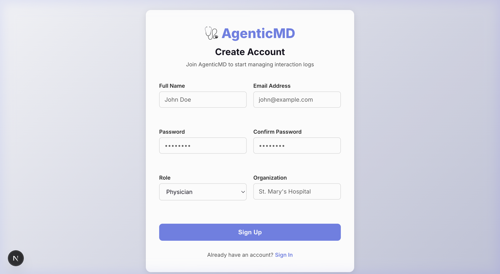
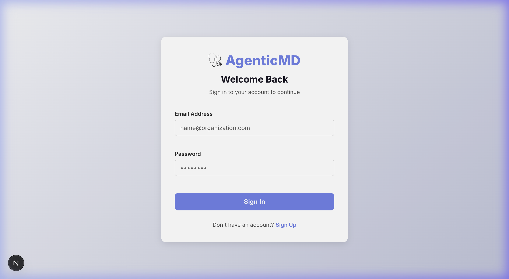
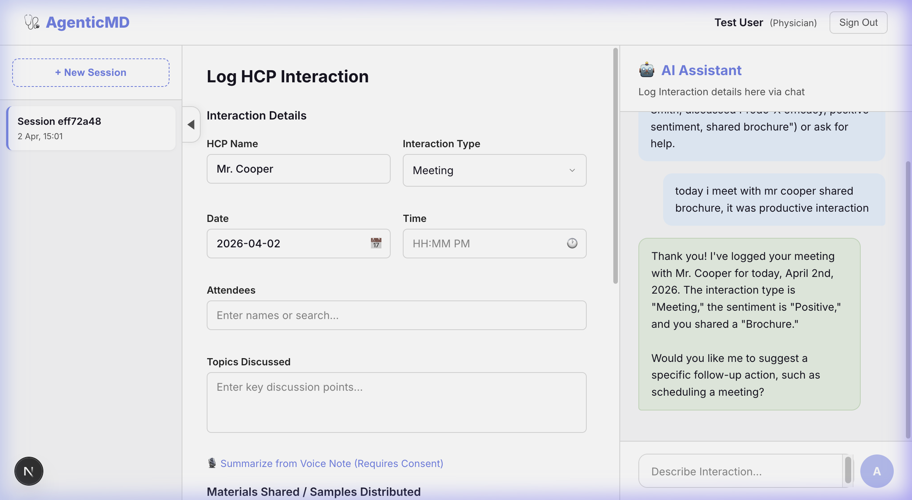
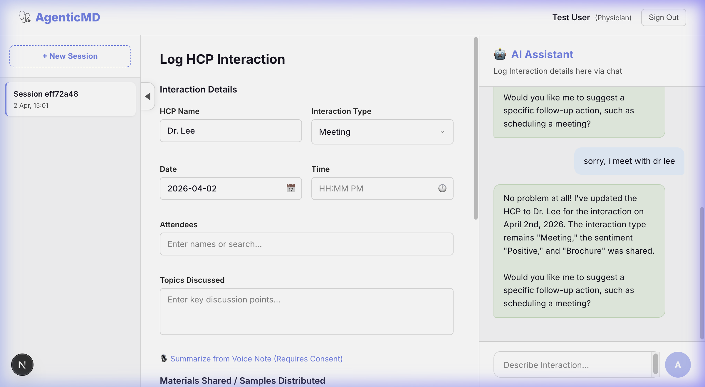

# AgenticMD Frontend Documentation

The AgenticMD frontend is a modern React application built with Next.js, providing a seamless and premium UI for HR professionals and physicians to manage interactions via an AI assistant.

## ✨ Features
- **User Authentication**: Secure signup and login with role-based access.
- **AI Assistant**: Natural language processing for form filling and interaction logging.
- **Real-time Updates**: Live state synchronization with the FastAPI backend.
- **Responsive Design**: Premium dark-mode aesthetics with fluid layouts.

## 🚀 Setup Guide

### Prerequisites
- Node.js (v18+)
- npm or yarn

### Installation
1. Navigate to the frontend directory:
   ```bash
   cd frontend
   ```
2. Install dependencies:
   ```bash
   npm install
   ```
3. Configure environment variables in `.env.local`:
   ```env
   NEXT_PUBLIC_API_URL=http://localhost:8000/api/v1
   ```

### Running the App
```bash
npm run dev
```
The application will be available at `http://localhost:3000`.

---

## 📸 User Guide & Instructions

### 1. Account Creation
Navigate to `/auth/signup` to create a new account. Provide your name, professional email, organization, and role.


### 2. Signing In
Use your registered email and password at `/auth/login` to access the AgenticMD dashboard.


### 3. AI-Assisted Interaction Logging
Once logged in, you can log interactions using the **AI Assistant** on the right side of the dashboard. For a deep dive into how the AI extracts data, see the [Interaction Guide](interaction.md).


#### 📝 Interaction Form Instruction:
1.  **Describe the Interaction**: In the chat input, type something like: *"Met with Dr. Smith today for 30 minutes. Discussed the new Prodo-X efficacy. He seemed very positive, and I shared the latest brochure with him."*
2.  **State Sync**: Watch as the AI automatically extracts the HCP Name, Interaction Type, Duration, Sentiment, and Materials Shared into the form on the left.
3.  **Refine & Log**: You can manually adjust any field or ask the AI to correct specific details. Once satisfied, click the "Log Interaction" button (automatically suggested by the AI).

## 💬 Chating Interaction Document

The chatting interface is the primary way users interact with the AgenticMD AI Assistant. It uses a natural, conversation-driven approach to log physician interactions.

### Features:
- **Natural Language Extraction**: High-precision extraction of HCP names, dates, and interaction types.
- **Dynamic Form Updates**: The form on the left updates in real-time as the AI processes chat messages.
- **Correction Support**: Users can say "Actually the doctor's name was Dr. Jones" to refine specific fields.
- **Contextual Awareness**: The AI maintains context throughout the conversation to provide relevant suggestions.

### 🎥 AI Interaction Example

#### 1. Initial Data Population
When the user provides a natural language description, the AI extracts key entities and populates the form fields on the left.
**Prompt**: *"today i meet with mr cooper shared brochure, it was productive interaction"*


#### 2. Refining Data
The user can easily correct any misextracted information or update details by simply telling the AI.
**Prompt**: *"sorry, i meet with dr lee"*

